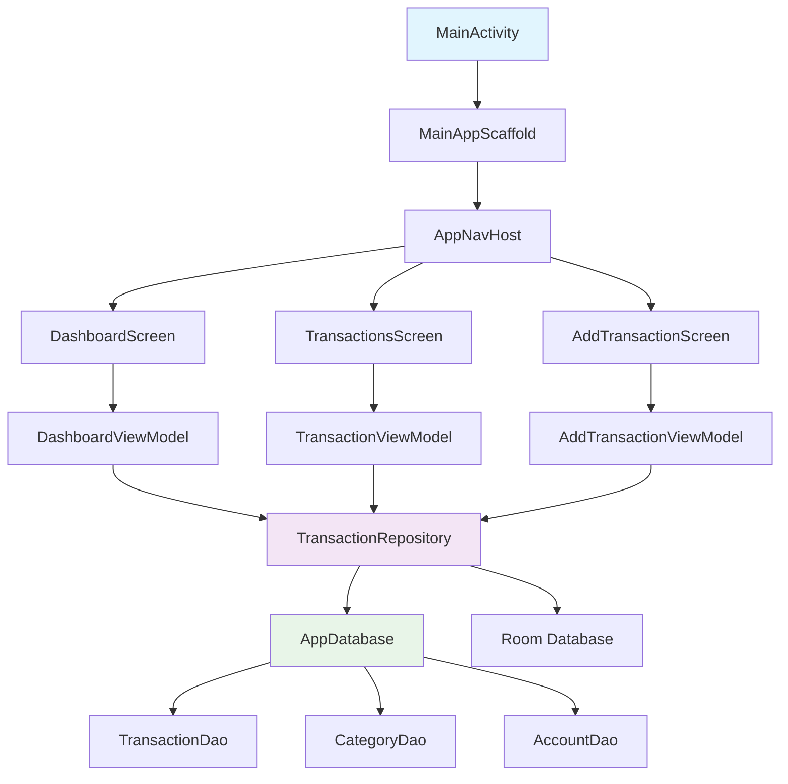

# 💰 Expenso - Smart Personal Finance Manager

<div align="center">

```
 ███████╗██╗  ██╗██████╗ ███████╗███╗   ██╗███████╗ ██████╗ 
 ██╔════╝╚██╗██╔╝██╔══██╗██╔════╝████╗  ██║██╔════╝██╔═══██╗
 █████╗   ╚███╔╝ ██████╔╝█████╗  ██╔██╗ ██║███████╗██║   ██║
 ██╔══╝   ██╔██╗ ██╔═══╝ ██╔══╝  ██║╚██╗██║╚════██║██║   ██║
 ███████╗██╔╝ ██╗██║     ███████╗██║ ╚████║███████║╚██████╔╝
 ╚══════╝╚═╝  ╚═╝╚═╝     ╚══════╝╚═╝  ╚═══╝╚══════╝ ╚═════╝ 
```

**Modern Android Finance Tracker with Material 3 Design**

[](https://android.com)
[](https://kotlinlang.org)
[](https://developer.android.com/jetpack/compose)
[](https://m3.material.io)
[](LICENSE)

</div>

## 🚀 Features

### 💸 **Transaction Management**
- ✅ Add income & expense transactions
- ✅ Categorize with custom emoji icons
- ✅ Multi-account support (Bank, Cash, UPI)
- ✅ Soft delete with recycle bin

### 📊 **Analytics & Reports**
- ✅ Monthly spending overview
- ✅ Category-wise expense breakdown
- ✅ Real-time balance calculation
- ✅ CSV export functionality

### 🎨 **Modern UI/UX**
- ✅ Material 3 design system
- ✅ Dark/Light/System theme support
- ✅ Responsive tablet layout
- ✅ Smooth animations

### 🔧 **Advanced Features**
- ✅ Backup & restore (JSON format)
- ✅ Monthly auto-export scheduling
- ✅ Notification system
- ✅ Offline-first architecture

## 📱 Screenshots

<div align="center">

| Dashboard | Transactions | Add Transaction |
|-----------|--------------|-----------------|
|  |  |  |

</div>

## 🏗️ Architecture



## 🛠️ Tech Stack

<details>
<summary><b>Core Technologies</b></summary>

- **Language:** Kotlin
- **UI Framework:** Jetpack Compose
- **Architecture:** MVVM + Repository Pattern
- **Dependency Injection:** Hilt
- **Database:** Room (SQLite)
- **Navigation:** Navigation Compose
- **Async:** Coroutines + Flow

</details>

<details>
<summary><b>Key Dependencies</b></summary>

```kotlin
// Core Android & Compose
implementation("androidx.compose.material3:material3")
implementation("androidx.navigation:navigation-compose")
implementation("androidx.lifecycle:lifecycle-viewmodel-compose")

// Database & DI
implementation("androidx.room:room-runtime")
implementation("com.google.dagger:hilt-android")

// Background Tasks
implementation("androidx.work:work-runtime-ktx")
implementation("androidx.datastore:datastore-preferences")
```

</details>

## 🚀 Quick Start

### Prerequisites
- Android Studio Hedgehog | 2023.1.1+
- Android SDK 26+
- Kotlin 1.9.23+

### Installation

1. **Clone the repository**
   ```bash
   git clone https://github.com/yourusername/expenso.git
   cd expenso
   ```

2. **Open in Android Studio**
   ```bash
   # Open Android Studio and select "Open an existing project"
   # Navigate to the cloned directory
   ```

3. **Build and Run**
   ```bash
   # Sync project with Gradle files
   # Run on device or emulator
   ```

## 📂 Project Structure

```
app/
├── src/main/java/com/yourname/expenso/
│   ├── data/                 # Database, DAOs, Repository
│   ├── di/                   # Dependency Injection modules
│   ├── model/                # Data classes (Transaction, Account, Category)
│   ├── navigation/           # Navigation setup
│   ├── notification/         # Notification management
│   ├── ui/                   # Compose UI screens & ViewModels
│   │   ├── dashboard/        # Main dashboard
│   │   ├── transactions/     # Transaction list
│   │   ├── add_transaction/  # Add/Edit transactions
│   │   ├── accounts/         # Account management
│   │   ├── categories/       # Category management
│   │   ├── settings/         # App settings
│   │   └── theme/           # Material 3 theming
│   └── util/                # Utilities (Backup, Reports, etc.)
```

## 🎯 Key Features Deep Dive

### 💾 **Data Management**
- **Room Database** with 3 entities: Transaction, Account, Category
- **Repository Pattern** for clean data access
- **Backup/Restore** functionality with JSON serialization

### 🎨 **UI/UX Excellence**
- **Material 3** design system implementation
- **Adaptive layouts** for phones and tablets
- **Dynamic theming** with system theme detection

### 📊 **Analytics Engine**
- Real-time balance calculation
- Category-wise spending analysis
- Monthly/yearly financial reports
- CSV export for external analysis

## 🤝 Contributing

We welcome contributions! Please see our [Contributing Guidelines](CONTRIBUTING.md) for details.

1. Fork the repository
2. Create your feature branch (`git checkout -b feature/AmazingFeature`)
3. Commit your changes (`git commit -m 'Add some AmazingFeature'`)
4. Push to the branch (`git push origin feature/AmazingFeature`)
5. Open a Pull Request

## 📄 License

This project is licensed under the MIT License - see the [LICENSE](LICENSE) file for details.

## 🙏 Acknowledgments

- [Material Design 3](https://m3.material.io/) for design guidelines
- [Jetpack Compose](https://developer.android.com/jetpack/compose) for modern UI toolkit
- [Android Architecture Components](https://developer.android.com/topic/architecture) for robust architecture

## 📞 Contact

**Developer:** Your Name  
**Email:** your.email@example.com  
**LinkedIn:** [Your LinkedIn](https://linkedin.com/in/yourprofile)

---

<div align="center">

**⭐ Star this repository if you found it helpful!**

Made with ❤️ and ☕ by [ A.K ]

</div>